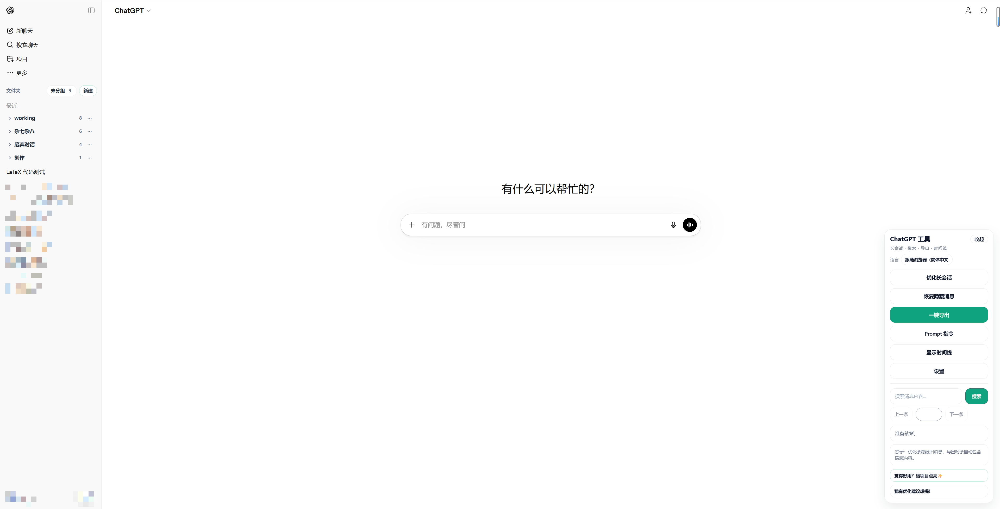

# ChatGPT Conversation Toolkit 🧰✨

简体中文 | [English](./README.en.md)

适用于 `ChatGPT Web` 的浏览器插件，主要解决长会话浏览、导出、搜索、Prompt 管理、时间线定位、对话文件夹管理和多语言界面切换问题 🚀

当前活跃维护者：`bujue3709`（主要 / 唯一活跃维护者）

当前支持站点 🌐

- `https://chat.openai.com/*` 💬
- `https://chatgpt.com/*` 🤖

## 功能概览 ✨

- 🧹 长会话折叠：隐藏较早消息，仅保留最近一段对话，降低长会话页面卡顿。
- 📦 全量导出：将当前会话导出为 JSON，即使已经折叠，也会保留被隐藏的消息。
- 🔍 消息搜索：按关键词搜索当前对话内容，支持高亮和前后跳转。
- 📚 Prompt 指令库：支持新增、删除、搜索、分类、排序、导入 JSON、导出 JSON、单击复制。
- 🕒 对话时间线：基于当前页面已加载的用户消息生成时间节点，支持预览、点击跳转、节点计数、显示/隐藏、拖拽移动。
- 📁 对话文件夹：在“你的聊天”上方提供极简文件夹管理条，支持新建、重命名、删除、折叠/展开、拖拽归类、移回未分组，并保留原生会话菜单能力。
- 🌐 多语言支持：当前支持中文和英文，默认跟随浏览器语言自动匹配；若没有匹配项则回退到英文，并支持在工具栏中手动切换。
- 🎨 主题同步：工具栏、时间线、Prompt 弹窗跟随 ChatGPT 明暗主题。
- 🧲 拖拽浮层：工具栏最小化按钮和时间线组件都支持拖拽移动。


## 安装方式 🧩

### Chrome 🌈

1. 打开 `chrome://extensions/`
2. 打开右上角“开发者模式”
3. 点击“加载已解压的扩展程序”
4. 选择当前项目根目录

### Edge 🌐

1. 打开 `edge://extensions/`
2. 打开右上角“开发人员模式”
3. 点击“加载已解压的扩展”
4. 选择当前项目根目录

### Firefox 🦊

1. 打开 `about:debugging#/runtime/this-firefox`
2. 点击“临时载入附加组件”
3. 选择当前项目根目录下的 [manifest.json](./manifest.json)

## 界面示意 🖼️




## 使用说明 ▶️

### 1. 工具栏 🧰

页面加载后，右下角会显示“ChatGPT 工具”浮层。

可直接执行的操作包括：

- `优化长会话` 🧹
- `恢复隐藏消息` ♻️
- `一键导出` 📦
- `Prompt 指令` 📚
- `显示/隐藏时间线` 🕒
- `搜索消息` 🔍
- `语言切换` 🌐

点击“收起”后，工具栏会变成圆形按钮。圆形按钮支持拖拽，拖拽结束后自动贴边，单击可恢复展开 🧲

### 1.1 多语言 🌐

- 插件启动时会优先读取用户浏览器语言，并自动匹配当前可用语言。
- 当前内置语言为：
  - `简体中文`
  - `English`
- 若浏览器语言没有匹配项，插件会默认使用 `English`。
- 工具栏头部提供语言切换菜单，可手动选择：
  - `跟随浏览器`
  - `English`
  - `简体中文`
- 手动切换后会立即刷新工具栏、时间线、Prompt 指令库、文件夹管理和状态提示文案，并自动保存你的语言选择 💾

### 2. 长会话折叠 🧹

- 点击“优化长会话”后，会隐藏较早消息，仅保留最近 `20` 条消息。
- 点击“恢复隐藏消息”后，会把之前隐藏的消息重新插回页面。
- 恢复时会尽量保持当前阅读位置，避免页面突然跳到顶部 👀

### 3. 导出 📦

- 点击“一键导出”会生成当前会话的 JSON 文件并自动下载。
- 若当前会话已经执行过折叠，导出仍然会包含全部消息 ✅

### 4. 搜索 🔍

- 在工具栏搜索框输入关键词后按回车，或点击搜索按钮开始搜索。
- 搜索结果会高亮显示 ✨
- 可以通过“上一条 / 下一条”在匹配结果间跳转。
- 若当前消息仍处于折叠状态，搜索前需要先恢复隐藏消息。

### 5. 时间线 🕒

- 时间线位于对话区域左侧。
- 只使用“当前页面已加载”的用户消息生成节点，不会主动请求未加载内容。
- 节点计数格式为：`当前节点/总用户节点数`
- 鼠标移入节点可预览消息内容 👁️
- 单击节点可跳转到对应用户消息。
- 页面滚动时，会同步激活当前视口附近的时间节点。
- 鼠标滚轮可以滚动时间线。
- 时间线头部支持拖拽移动 🧲
- 滚动到顶部但没有更多可见消息时：
  - 若消息已经全部可见，提示 `已经没有消息了`
  - 若旧消息被折叠隐藏，提示 `请恢复隐藏消息`

### 6. Prompt 指令库 📚

- 点击“Prompt 指令”打开弹窗。
- 支持：
  - 搜索标题 / 分类 / 内容 🔎
  - 按分类筛选 🗂️
  - 按更新时间、标题、分类排序 ↕️
  - 新增 Prompt ➕
  - 删除 Prompt 🗑️
  - 导入 JSON 📥
  - 导出 JSON 📤
  - 单击复制内容 📋
- 复制成功后会显示提示 ✅

### 7. 对话文件夹 📁

- 文件夹管理条会显示在侧边栏“你的聊天”标题上方。
- 支持点击 `新建` 创建文件夹。
- 点击文件夹头可折叠 / 展开当前文件夹下的会话。
- 点击文件夹右侧菜单可进行：
  - 重命名 ✏️
  - 删除 🗑️
- 支持把未分组会话拖到某个文件夹中。
- 支持把文件夹内会话拖回 `未分组`。
- 拖拽命中范围包括：
  - 文件夹头
  - 文件夹内会话区域
  - 文件夹管理的可见会话段空白区域
- 文件夹只对侧边栏会话做本地分类和排序，不会替换原生会话节点，因此原生的重命名、归档、更多菜单仍然可用 ✅
- 文件夹、归类关系和折叠状态会自动持久化，刷新页面后恢复 💾

## 请作者喝杯奶茶 🧋
如果这个插件对你有用，欢迎顺手点个 Star ⭐，真的非常感谢！


## 项目结构（以下内容非开发者可跳过） 🏗️

当前项目已经完成基础模块拆分，`manifest.json` 会按顺序注入以下脚本：

```text
core/
  state.js
  i18n.js

features/
  collapse.js
  export.js
  folders.js
  search.js
  timeline.js
  prompt-library.js

ui/
  theme.js
  toolbar.js

utils/
  dom.js
  storage.js

contentScript.js
styles.css
manifest.json
```

### 模块职责 🧭

- [core/state.js](./core/state.js)
  - 全局常量、运行时状态、基础配置 🧠
- [core/i18n.js](./core/i18n.js)
  - 多语言字典、语言检测、语言切换与界面刷新 🌐
- [utils/dom.js](./utils/dom.js)
  - DOM 读取、消息节点识别、通用拖拽调度 🧩
- [utils/storage.js](./utils/storage.js)
  - 本地持久化、位置和显示状态保存 💾
- [ui/theme.js](./ui/theme.js)
  - ChatGPT 明暗主题识别与同步 🎨
- [ui/toolbar.js](./ui/toolbar.js)
  - 工具栏、最小化按钮、拖拽交互 🧰
- [features/collapse.js](./features/collapse.js)
  - 长会话折叠与恢复 🧹
- [features/export.js](./features/export.js)
  - 会话导出 📦
- [features/folders.js](./features/folders.js)
  - 侧边栏对话文件夹管理、拖拽归类、本地持久化恢复 📁
- [features/search.js](./features/search.js)
  - 消息搜索与跳转 🔍
- [features/timeline.js](./features/timeline.js)
  - 时间线渲染、预览、滚动、拖拽、节点同步 🕒
- [features/prompt-library.js](./features/prompt-library.js)
  - Prompt 指令库读写、筛选、复制、导入导出 📚
- [contentScript.js](./contentScript.js)
  - 启动入口、初始化、DOM 观察器 🚦
- [styles.css](./styles.css)
  - 工具栏、时间线、Prompt 弹窗样式 🎨

## 可调整配置 ⚙️

常用配置位于 [core/state.js](./core/state.js)。

例如：

```js
const TIMELINE_VISIBLE_NODE_CAPACITY = 10;
const TIMELINE_MAX_NODES = 20;

const state = {
  isCollapsed: false,
  isMinimized: false,
  keepLatest: 20,
  collapsedNodes: [],
  cachedNodes: [],
};
```

字段说明 📝

- `keepLatest`：执行“优化长会话”后保留的最新消息数量
- `TIMELINE_VISIBLE_NODE_CAPACITY`：时间线单屏大致可容纳的节点数
- `TIMELINE_MAX_NODES`：时间线最大采样节点数

## 导出的会话 JSON 格式 📦

```json
{
  "exportedAt": "2026-03-13T08:30:00.000Z",
  "url": "https://chatgpt.com/c/xxxxxxxx",
  "messageCount": 2,
  "messages": [
    {
      "index": 1,
      "role": "user",
      "text": "你的消息"
    },
    {
      "index": 2,
      "role": "assistant",
      "text": "ChatGPT 的消息"
    }
  ]
}
```

字段说明 🧾

- `exportedAt`：导出时间，ISO 8601 格式
- `url`：当前会话页面地址
- `messageCount`：导出的消息数量
- `messages`：消息数组
- `messages[].index`：消息顺序
- `messages[].role`：消息角色，通常为 `user` 或 `assistant`
- `messages[].text`：消息文本内容

## Prompt 指令库 JSON 格式 📚

Prompt 指令库导出为对象格式：

```json
{
  "version": 1,
  "updatedAt": "2026-03-13T08:30:00.000Z",
  "prompts": [
    {
      "id": "c94f7299-40f3-4f95-a9f7-0ff93029a3f8",
      "title": "日报总结",
      "category": "办公",
      "content": "请将今天工作整理为日报，按完成项、风险、计划输出。",
      "createdAt": 1741576200000,
      "updatedAt": 1741576200000
    }
  ]
}
```

字段说明 🧾

- `version`：格式版本，当前为 `1`
- `updatedAt`：整个 Prompt 库的更新时间
- `prompts`：Prompt 数组
- `prompts[].id`：唯一 ID
- `prompts[].title`：标题
- `prompts[].category`：分类
- `prompts[].content`：正文
- `prompts[].createdAt`：创建时间戳
- `prompts[].updatedAt`：更新时间戳

### 导入兼容格式 🔄

支持两种格式：

#### 1. 对象格式 ✅

```json
{
  "prompts": [
    {
      "title": "代码评审",
      "category": "开发",
      "content": "请按严重级别列出问题并给修复建议。"
    }
  ]
}
```

#### 2. 数组格式 ✅

```json
[
  {
    "title": "需求拆解",
    "category": "产品",
    "content": "请拆解为任务并给出优先级和验收标准。"
  }
]
```

导入规则 📥

- `content` 为空的记录会被忽略
- `title` 为空时会自动根据正文生成标题
- `category` 为空时自动归类为 `未分类`
- 重复项按 `title + category + content` 去重，比较时不区分大小写

## 开发说明 🛠️

- 当前项目不依赖打包器。
- 修改脚本后，浏览器扩展页重新加载插件即可生效。
- 内容脚本的执行顺序由 [manifest.json](./manifest.json) 中 `content_scripts.js` 数组控制。

## 已知限制 ⚠️

- 时间线只基于当前页面已经加载出来的消息节点，不会主动把 ChatGPT 未渲染的历史消息拉出来。
- 搜索功能只对当前页面存在的消息 DOM 生效；若消息已被折叠，需要先恢复隐藏消息。
- 文件夹管理基于当前 ChatGPT 侧边栏 DOM 结构实现，本地保存分类关系，不会同步到 ChatGPT 服务端。
- 不同 ChatGPT 页面版本可能调整 DOM 结构，少数选择器可能需要跟进适配。

## License 📄

本项目采用 [MIT License](./LICENSE)。

这意味着你可以在遵守 MIT 许可证文本保留要求的前提下，自由使用、复制、修改、发布、分发，且允许商业使用与再分发。

### 非许可说明 🏷️

为避免误导，请不要错误表示原项目名称、作者身份或品牌归属；如果你分发的是修改版或非官方版本，建议明确标注。此说明仅用于避免误导，不构成额外的许可证限制。
